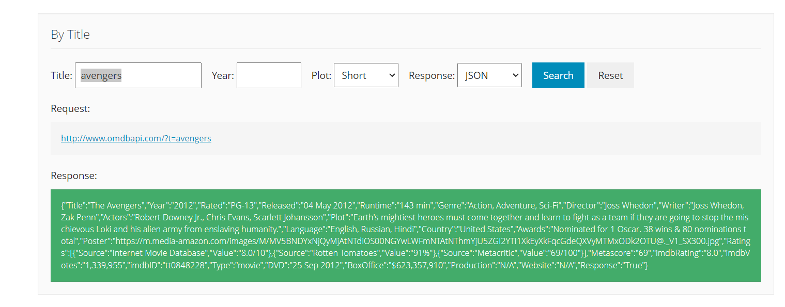
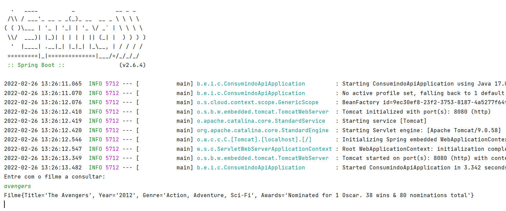

# Desenvolvimento de Serviços em Nuvem com Java

## Teste de performance 1

Desenvolva um projeto simples com Spring Boot que implemente um microsserviço elementar de consulta que demonstre o entendimento da criação de um projeto simples nessa plataforma.

## Consumindo API OMDB

Endereço: http://www.omdbapi.com/

## Cliente em execução

